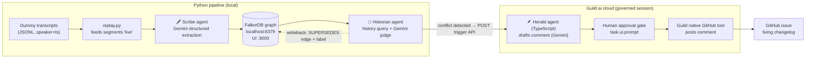

# PRD — **Drift**

*Your GitHub issues go stale the moment the meeting ends. Drift catches it.*

**Hackathon:** Memory Meets Motion · Aug 3, 2026 · submission 3:30 PM
**Stack:** FalkorDB (memory) · Guild.ai (agent orchestration + governance) · Gemini API (agent brains) · GitHub (the visible output)
**Hard constraint:** the `~/MeetingScribe` folder is **never read or modified**. Dummy transcripts simulate its output.

---

## 1. Problem

Decisions about engineering work happen in meetings; the work itself is tracked in GitHub issues. The two drift apart immediately: a deadline moves in Monday's standup, the approach changes in sprint planning, an owner gets reassigned in a hallway sync — and the issue still says what it said three weeks ago. The developer who finally picks it up executes a stale plan.

## 2. Solution

Drift listens to meeting transcripts, builds a **permanent knowledge graph** of who-said-what-about-which-issue across every meeting (FalkorDB), and when a new meeting **changes or contradicts** what was previously decided about an issue, a **governed Guild.ai agent posts a comment on that GitHub issue** — what changed, who said it, in which meeting, with the transcript quote. The issue's comment thread becomes a living changelog of every discussion about it. Memory (graph) meets Motion (agent action).

## 3. Sponsor research findings that shaped this design (verified today)

1. **Guild.ai is NOT the old ML experiment tracker.** It's a new company (launched Apr 2026): "The Control Plane for AI Agents" — deploy typed agents to their cloud, trigger them via REST, with per-session event logs, credential governance, native GitHub tools, and human-in-the-loop prompts. **TypeScript SDK only** (`@guildai/agents-sdk`, private npm unlocked by `guild auth login`); Python talks to it via the trigger REST API. Never `pip install guildai` — that's the unrelated dead 2023 package.
2. **FalkorDB is already running on this Mac** — container `falkordb-test`, DB on `localhost:6379`, browser graph UI on `http://localhost:3000`, clean state. Python client: `pip install falkordb`.
3. **Gemini:** current SDK is `google-genai` (not `google-generativeai`), model `gemini-3.5-flash` (free tier, ~10 requests/min — the binding constraint; calls must be serialized with 429 retry). Schema-constrained JSON output via `response_json_schema` = zero parsing failures.
4. **GitHub:** `gh` CLI v2.95.0 already authenticated as **sharique2004** with full repo scope. Issue comments support GFM alert banners, before/after tables, collapsible `<details>`, and mermaid — a rich demo surface for free.

## 4. Architecture



**Division of labor (forced by Guild's sandbox):** Guild agents can only import `@guildai/agents-sdk`, `zod`, and Guild service tools — no Redis/FalkorDB client runs there. So all graph logic stays in Python; Guild owns the *action*: drafting, human approval, and posting via its own GitHub credential. That's genuinely load-bearing — every outbound action is a governed, audited Guild session.

### The three agents

| Agent | Where | Job |
|---|---|---|
| **Scribe** | Python + Gemini | Extracts statements from each transcript segment: `{speaker, topic, issue_ref?, claim, kind: decision\|update\|assignment\|question}` |
| **Historian** | Python + Gemini | After each statement lands, pulls that issue's full decision history from the graph (multi-hop Cypher) and judges: `{conflict: bool, before, after, what_changed}` |
| **Herald** | **Guild.ai cloud** (TypeScript) | Receives the conflict payload, drafts the GitHub comment with Gemini, **pauses for human approval**, posts via Guild's native GitHub tool |

## 5. The exact workflow, step by step

**Step 0 — Seed (one-time, ~30s).** `seed.py`, into the existing repo **`sharique2004/mmm-demo`** (confirmed live, empty, issues enabled):
- 4 realistic engineering issues (e.g. #1 "Migrate auth to OAuth2", #2 "Cache layer for ingestion", #3 "Mobile offline mode", #4 "Rate-limit public API") + labels `decision-changed`, `from-meeting`.
- Mirrors each as an `(:Issue {number, repo, title})` node in FalkorDB, plus a full-text index on `Issue.title`.

**Step 1 — Replay.** `pipeline.py transcripts/<meeting>.jsonl` feeds segments (`{ts, speaker, text}`) as if the meeting is happening now. Two past meetings (Jul 28 kickoff, Jul 31 standup) are pre-ingested before the demo; the Aug 3 sprint-planning transcript runs live on stage.

**Step 2 — Extract (Scribe).** Segments are batched (~8 per call, respecting the 10 RPM free tier) into one Gemini call with schema-constrained JSON output.

**Step 3 — Link statement → issue.** Explicit `#N` mentions map directly; otherwise full-text search `db.idx.fulltext.queryNodes('Issue', '<topic>*')` (prefix `*` required — verified that whole-token matching misses otherwise).

**Step 4 — Remember.** Idempotent parameterized `MERGE` (keyed on `segment_id`, safe to re-run):

```cypher
MERGE (p:Person {name: $person})
MERGE (m:Meeting {id: $meeting_id}) ON CREATE SET m.title=$title, m.date=$date
MERGE (i:Issue  {number: $issue_number})
MERGE (s:Statement {segment_id: $segment_id})
  ON CREATE SET s.text=$text, s.kind=$kind, s.ts=$ts
MERGE (p)-[:SAID]->(s)  MERGE (s)-[:ABOUT]->(i)  MERGE (s)-[:IN_MEETING]->(m)
```

**Step 5 — Detect (Historian).** For each issue touched by a new decision/assignment statement, pull ordered history:

```cypher
MATCH (p:Person)-[:SAID]->(s:Statement)-[:ABOUT]->(i:Issue {number: $n}),
      (s)-[:IN_MEETING]->(m:Meeting)
RETURN m.date, m.title, p.name, s.kind, s.text ORDER BY m.date ASC
```

A small Gemini judge call compares the newest statement against prior decisions → `{conflict, before, after, what_changed}`.

**Step 6 — Act (Herald, on Guild).** On conflict, Python fires a governed Guild session:

```python
requests.post(f"https://app.guild.ai/api/workspaces/{OWNER}/{WS}/sessions",
    auth=(KEY_ID, KEY_SECRET),   # HTTP Basic, from Guild web UI → Triggers → API
    json={"session_type": "api_trigger", "agent_input": {
        "repo": "sharique2004/mmm-demo", "issue_number": 2,
        "prior_decision": "Redis cache, Sam, due Aug 10",
        "new_decision": "in-memory LRU, Priya, due Aug 14",
        "speaker": "Priya", "meeting": "Sprint Planning (Aug 3)",
        "quote": "Redis is overkill for v1 — let's ship an LRU dict and revisit."}})
```

Inside Guild, Herald drafts the comment (`task.llm.generateText`, Gemini via workspace BYOK), **blocks on `task.ui.prompt` for human approval** (the judges' human-in-the-loop moment, visible in Guild's session Events tab), then posts via `github_issues_create_comment`.

**Step 7 — Writeback.** Python adds `(new)-[:SUPERSEDES]->(old)` in the graph and the `decision-changed` label via `gh` — so the graph itself remembers that the decision changed, compounding across future meetings.

### What the developer sees on the issue

> [!IMPORTANT]
> **Decision changed** in a later meeting — this supersedes the issue's original scope.
>
> | Field | Before (Kickoff, Jul 28) | After (Sprint Planning, Aug 3) |
> |---|---|---|
> | Approach | Redis cache | **in-memory LRU** |
> | Owner | Sam | **Priya** |
> | Deadline | Aug 10 | **Aug 14** |
>
> <details><summary>Meeting excerpt</summary>
>
> [14:02] **Priya:** Redis is overkill for v1 — let's ship an LRU dict and revisit.
> </details>
>
> *Meeting: Sprint Planning, Aug 3 · Detected by Historian (FalkorDB graph diff) · Posted via Guild.ai governed session `sess_…`*

## 6. Repo layout

```
Memory Meets Motion/
├── PRD.md  ·  problem-statement.txt
└── drift/
    ├── .env                      # GEMINI_API_KEY, GUILD_KEY_ID/SECRET/OWNER/WS, REPO
    ├── requirements.txt          # falkordb google-genai pydantic requests python-dotenv
    ├── transcripts/              # 3 dummy meetings (JSONL: ts, speaker, text)
    ├── seed.py                   # GitHub repo+issues, FalkorDB Issue nodes+index
    ├── extractor.py  graph.py  detector.py     # Scribe / memory / Historian
    ├── guild_trigger.py  github_tools.py  pipeline.py
    └── guild-agent/agent.ts      # Herald — deployed with `guild agent save --publish`
```

## 7. Demo script (90 seconds)

1. Open issue #2 — written Jul 28, says "Redis cache, Sam, Aug 10." **This is what the developer would build today.**
2. FalkorDB browser (`localhost:3000`): graph of 2 past meetings already remembered.
3. Run the Aug 3 sprint-planning transcript "live" — statements stream, graph grows on refresh.
4. Historian flags the conflict → Guild session spawns → show Guild's **Events tab**: Gemini draft, then the **approval prompt**. Click approve.
5. Refresh the GitHub issue: the changelog comment is there. "The developer now builds the right thing."
6. Kicker: kill the pipeline, restart, query the graph — memory survived. *Memory met motion.*

## 8. What I need from Sharique (the only blockers)

1. **Gemini key:** grab free at `aistudio.google.com/apikey` → paste here (goes in `.env` as `GEMINI_API_KEY`).
2. **Guild.ai (interactive, ~5 min):** run `npm install -g @guildai/cli` then `guild auth login` (type `! guild auth login` in this session so I see the output). Then in the Guild web app: create workspace → **LLM settings: add the Gemini key (BYOK)** → **Credentials: connect GitHub** to the demo repo → **Triggers → New → API**: copy `api_key_id` + `api_key_secret` here.
3. **GitHub:** nothing — `gh` is already authenticated as sharique2004.

## 9. Build order & fallbacks (~3h left)

| Order | Work | Fallback |
|---|---|---|
| 1 | `graph.py` + `seed.py` + transcripts + `extractor.py` — memory core end-to-end, testable with zero external accounts | — (core, must work) |
| 2 | `detector.py` + full local pipeline | — |
| 3 | Herald on Guild (`guild agent init/test/save --publish`) + trigger wiring | `DIRECT_POST=1` flag: `github_tools.post_comment` posts directly; Guild trigger code stays in place to swap back |
| 4 | Polish: seeded past meetings, comment formatting, graph UI staging | Terminal + issue page alone still demos |
| 5 | Submit via Discord `/submit` by 3:30 | — |

**Known risks:** Gemini 10 RPM (mitigated: batching + serialized calls + 429 backoff); Guild `task.ui.prompt` blocks until answered (mitigated: auto-approve env flag as demo insurance); Guild private-npm SDK needs `guild auth login` first (do it before anything else Guild-related).

## 10. Assumptions (correct me if wrong)

- ~~Repo~~ **Resolved:** demo repo is `sharique2004/mmm-demo` (exists, empty — seed.py fills it).
- Sponsors: FalkorDB + Guild.ai only (LaserData/RocketRide consciously dropped).
- Demo surfaces = GitHub issue + FalkorDB browser UI + Guild session log; no custom dashboard.
- Product name "Drift" — rename freely.
